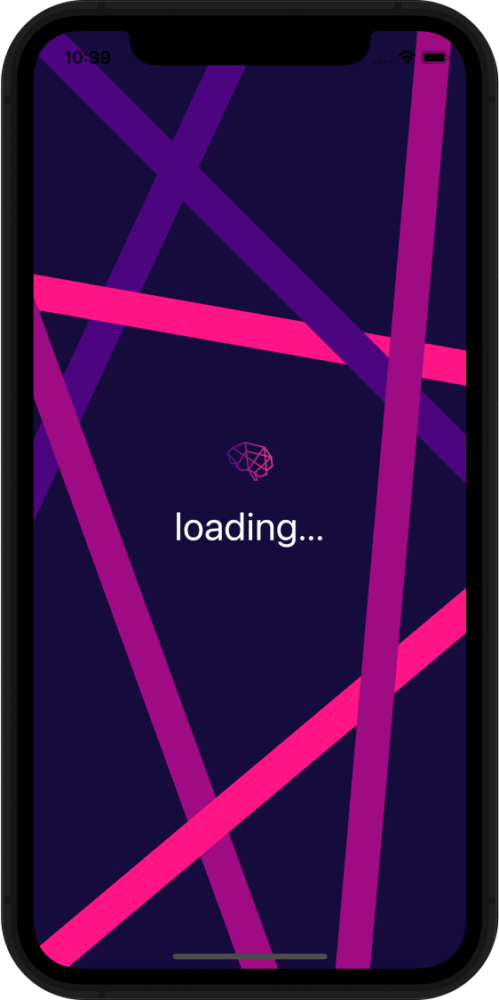
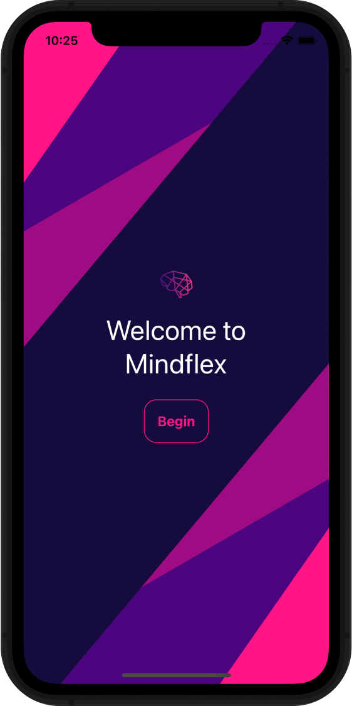
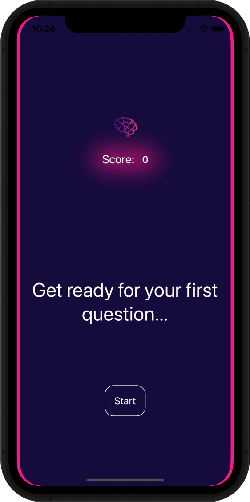
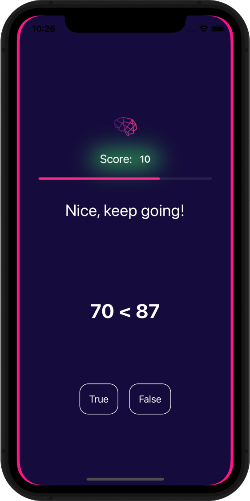
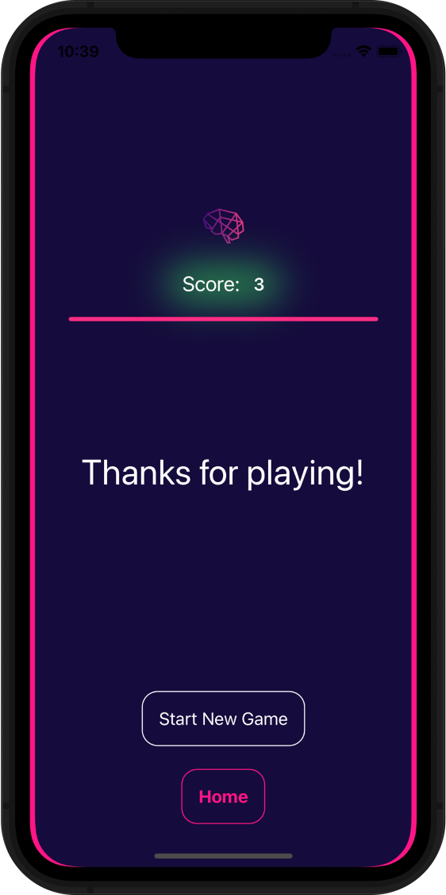

# Mindflex

<!-- HEADER -->

<!-- Logo -->
    
<!-- Tagline -->
    

        <em>Flex your mind</em>
     
    

<!-- Links -->
    

        <a href="https://github.com/yoshiohasegawa/mindflex/issues">Report Bug</a>
    

<!-- BODY -->
# Table of Contents
1. [About](#about)
    * [Back-End](#back-end)
    * [Tech Stack](#tech-stack)
    * [Key Features](#key-features)
2. [Coming Soon](#coming-soon)
    * [User Accounts](#user-accounts)
    * [Game Modes](#game-modes)
    * [Sound Effects](#sound-effects)
4. [Contact](#contact)

# About
Mindflex is an iOS game application built with Swift. It is a simple and fun reflex quiz game that challenges your mind. The user is presented with random arithmetic questions and, they must answer the question correctly in under 3 seconds.

## Back-End
This game is supported by a backend server hosted on a cloud machine that provides endpoints and routes for question data. The server is built with Python and Flask. The database is a noSQL MongoDB database. When the application starts, an API request is made during the loading page which responds with question data that supports gameplay. Once the request has been fulfilled, the application continues to the Welcome screen.

## Tech Stack
- [Swift](https://swift.org/)
- [Python](https://www.python.org/)
- [Flask](https://flask.palletsprojects.com/en/2.0.x/)
- [MongoDB](https://www.mongodb.com/)
- [Heroku](https://www.heroku.com/)

## Key features

### *Loading Screen*
This is where an initial API call is made to fetch relevant data.
<table border="0">
 <tr>
    <td width="300px">
        
    </td>
    <td>
        

            <ul>
                <li/>Gameplay data is fetched and loaded.
                  
                <li/>The loading text is dynamic for a more sophisticated feel.
            </ul>
        

    </td>
 </tr>
</table>

### *Home Screen*
Simply tap *Begin* to get started.
<table border="0">
 <tr>
    <td width="300px">
        
    </td>
    <td>
        

            <ul>
                <li/>In the future, we hope to build game modes that the user can select from.
            </ul>
        

    </td>
 </tr>
</table>

### *Get Ready Screen*
The user is prompted to begin the game here.
<table border="0">
 <tr>
    <td width="300px">
        
    </td>
    <td>
        

            <ul>
                <li/>This screen allows for the user to anticipate gameplay.
            </ul>
        

    </td>
 </tr>
</table>

### *Play Screen*
This is the gameplay screen, the main feature of the application.
<table border="0">
 <tr>
    <td width="300px">
        
    </td>
    <td>
        

            <ul>
                <li/>A score is shown at the top that is highlighted with a green background, as the user answers questions correctly.
                  
                <li/>A progress bar is displayed and completes at 3 seconds.
                  
                <li/>A motivating message is shown for specific point values. I wonder what it says for 100? 🤔
                  
                <li/>The arithmetic question is shown in bold text.
                  
                <li/>The user must answer <em>True</em> or <em>False</em>.
            </ul>
        

    </td>
 </tr>
</table>

### *Game Over Screen*
This is where the user may start a new game.
<table border="0">
 <tr>
    <td width="300px">
        
    </td>
    <td>
        

            <ul>
                <li/>If the user answers a question incorrectly or, time runs out, the game ends.
                  
                <li/>The user may start a new game or, return to the Home screen.
            </ul>
        

    </td>
 </tr>
</table>

# Coming Soon
### User Accounts
- We hope to enable users to create User Accounts in order to keep track of high scores.
### Game Modes
- Different game modes will keep things exciting and, allow users to not only challenge themselves in arithmetic but, also in other topics found in basic trivia.
### Sound Effects
- Sound effects and audio makes games like this much more fun! Keep an eye out for this in the near future.

# Contact
For support, feedback or, to report a bug, you may contact the maintainer:
- Yoshio Hasegawa: [GitHub](https://github.com/yoshiohasegawa), [LinkedIn](https://www.linkedin.com/in/yoshiohasegawa/)

## License
Distributed under the MIT License.